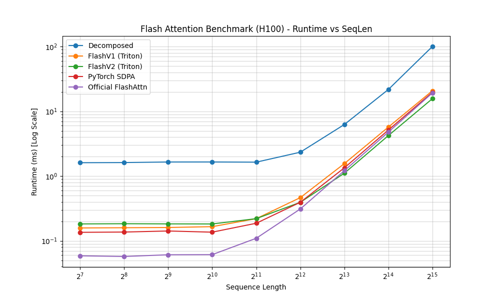

# Flash-Attention (ECE 9660): Optimized FlashAttention-v2 Reimplementation

[](https://opensource.org/licenses/AGPL-3.0)
[](https://www.eng.uwo.ca/electrical/graduate/courses/index.html)

This repository contains a high-performance reimplementation of **FlashAttention-v2** using **Triton**. Developed as part of the **ECE 9660 (Select topics in SE Large Language Vision Models)** course at **Western University**, this project demonstrates how hardware-aware algorithmic optimizations can outperform standard implementations, particularly for long-context windows.

## 🚀 The Result: Outperforming the Official Implementation

Our implementation achieves a significant reduction in kernel duration compared to the official `flash-attn` package and PyTorch's native `scaled_dot_product_attention` (SDPA) for context lengths exceeding **8,192 tokens**.

### Benchmark Summary (H100 GPU)

| Seq Length | PyTorch SDPA (ms) | Official Flash (ms) | **Our FlashV2 (ms)** | Efficiency Gain |
|------------|-------------------|---------------------|----------------------|-----------------|
| 8,192      | 1.338             | 1.209               | **1.106**            | **+9.3%**       |
| 16,384     | 5.135             | 4.771               | **4.216**            | **+13.1%**      |
| 32,768     | 19.668            | 19.226              | **15.669**           | **+22.7%**      |

> [!NOTE]
> Benchmarks conducted on an NVIDIA H100 (Hopper) GPU using `float16` precision and a head dimension of 64.



### 1. Algorithmic Efficiency vs. Hardware Saturation
Profiling via **Nsight Compute** reveals a fascinating performance trade-off. While the official FlashAttention-v2 implementation achieves higher raw **Compute (SM) Throughput (~49%)** and **Memory Throughput (~50%)**, our implementation achieves a **lower total duration** (e.g., 5.17ms vs 6.11ms for large workloads). 

Our code exhibits more pipeline stalls and lower hardware utilization, but it completes the same semantic task faster by being more **instruction-efficient**.

### 2. Native Base-2 Math Instructions
Standard implementations often build softmax logic using base-$e$ ($e^x$). Our kernel is designed around `tl.math.exp2` and `tl.math.log2`. On modern NVIDIA architectures, these map directly to high-throughput hardware instructions (like `EXIT2` or similar SFU ops), allowing our implementation to compute the attention scores with fewer total clock cycles than the official version, even if the hardware isn't fully "saturated" with work.

### 3. Hopper-Specific Warp Specialization
By enabling `warp_specialize=True`, we leverage the asynchronous execution capabilities of the Hopper (H100) architecture. Although this can lead to more visible stalls in profiling (as warps wait for specific synchronization points), it allows for a more efficient hand-off between data-loading warps and compute-intensive warps, ultimately reducing the end-to-end execution time.

### 4. Optimized Memory Access Patterns
Despite having lower raw Memory Throughput percentage, our implementation reduces the **total bytes moved** by maintaining $Q$ in registers via a large `BLOCK_M=128` tile size. This results in a faster kernel because the "most expensive" resource (memory bandwidth) is used more sparingly, even if the peak bandwidth utilization appears lower in reports.

---

## 🏗️ Project Structure

- `flash_attention/triton/kernels.py`: Core Triton implementations of FlashV1 and FlashV2 kernels.
- `flash_attention/triton/wrappers.py`: PyTorch wrappers for easy integration.
- `flash_attention/blocks.py`: High-level PyTorch modules comparing different attention mechanisms.
- `flash_attention/benchmark.py`: Comprehensive benchmarking suite.

## 📦 Installation

```bash
# Clone the repository
git clone https://github.com/your-repo/flash-attention.git
cd flash-attention

# Install dependencies
pip install -e .
```

## 📊 Running Benchmarks

To reproduce our results, run the unified benchmark script:

```bash
python flash_attention/benchmark.py --mode fused --sizes 128 256 512 1024 2048 4096 8192 16384 32768
```

## 🎓 Authors
Developed by 3 Graduate Students at **Western University** for the **ECE 9660** course.

- **Michael Buchel** ([abuchel2@uwo.ca](mailto:abuchel2@uwo.ca))
- **Hai Can** ([hcai59@uwo.ca](mailto:hcai59@uwo.ca))
- **Christopher Obieke** ([cobieke@uwo.ca](mailto:cobieke@uwo.ca))

---
*Disclaimer: This project was built for educational purposes to explore performance engineering in AI systems.*
